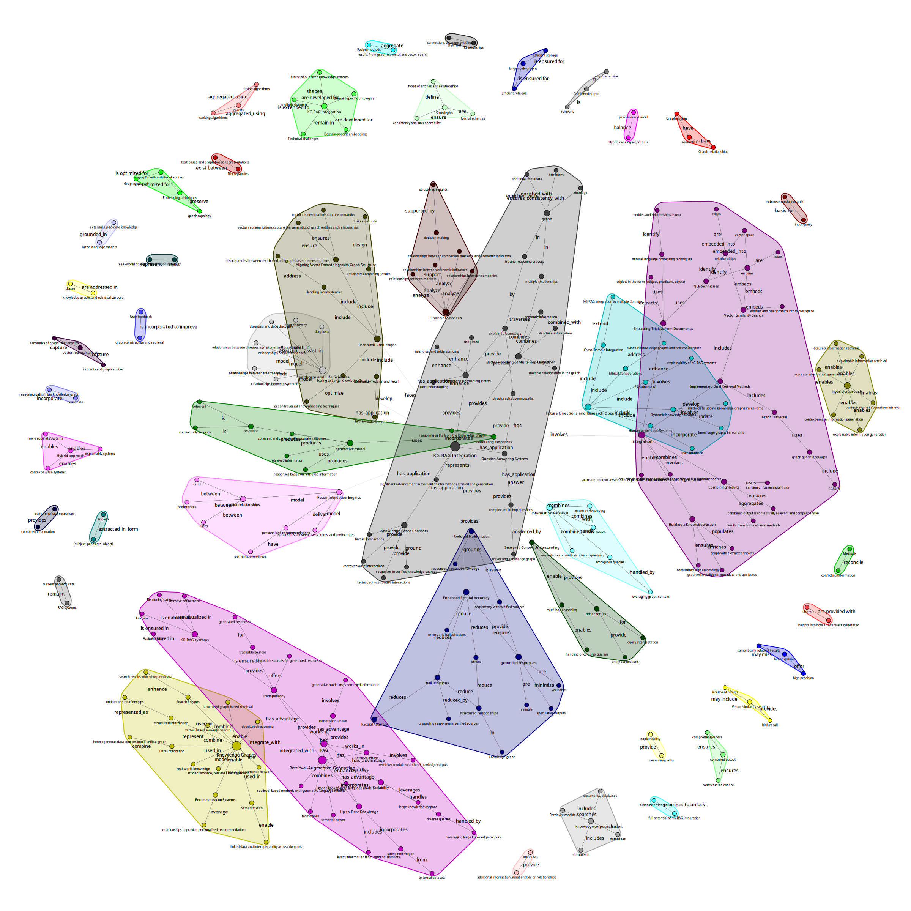

# Knowledge Graph RAG Integration Demo

A comprehensive framework for integrating Knowledge Graphs with Retrieval-Augmented Generation (RAG) systems to enhance information retrieval and generation capabilities.

## Overview

This project demonstrates a powerful hybrid approach that combines structured Knowledge Graphs with vector-based Retrieval-Augmented Generation. By leveraging both graph-based and embedding-based retrieval, the system delivers more accurate, contextually aware, and explainable results for complex queries.


## Key Features

- **Triplet Extraction**: Automatically extract semantic triplets (subject-predicate-object) from text documents
- **Knowledge Graph Construction**: Build structured knowledge graphs from extracted triplets
- **Multi-Modal Retrieval**: Combine graph traversal with vector similarity search
- **Hybrid Query Processing**: Answer complex queries using both graph and vector-based information
- **Multi-Threading Support**: Parallel processing for improved performance
- **Visualization Tools**: Generate high-quality graph visualizations
- **Comprehensive Testing**: Extensive debug and testing framework

## System Architecture

The system consists of several integrated modules:

1. **Text Chunker & RAG** (`text_chunker_rag.py`): Handles document processing, chunking, and vector database operations
2. **Triplet Generator** (`kg_triplet_generator.py`): Extracts knowledge graph triplets from text
3. **KG-RAG Integration** (`kg_rag_integration.py`): Combines knowledge graph with RAG for enhanced retrieval
4. **Graph Visualization** (`graph_viz.py`): Creates visual representations of knowledge graphs
5. **LLM Interface** (`query_llm.py`): Provides access to language models via the Hyperbolic API
6. **Testing Framework** (`debug_kg_rag.py`): Comprehensive testing and debugging capabilities

## Installation

### Prerequisites

- Python 3.8+
- Virtual environment (recommended)

### Setup

1. Clone the repository:
   ```bash
   git clone https://github.com/calhounpaul/knowledge-graph-RAG-vllm-deepseek
   cd kg-rag-demo
   ```

2. Create and activate a virtual environment:
   ```bash
   python -m venv venv
   source venv/bin/activate  # On Windows: venv\Scripts\activate
   ```

3. Install dependencies:
   ```bash
   pip install -r requirements.txt
   ```

4. Set up API key:
   Create a file `libs/hyperbolic_api_key.txt` containing your Hyperbolic API key.

## Usage

### Basic Usage

Process a document and build a knowledge graph:

```bash
python debug_kg_rag.py --input-file your_document.txt --output-dir ./out --db-path ./db
```

### Advanced Options

- `--input-file`: Path to the input document (defaults to sample data if not provided)
- `--output-dir`: Directory to save outputs (visualizations, triplets, etc.)
- `--db-path`: Path for the vector database storage
- `--keep-temp`: Keep temporary files after processing
- `--verbose`: Enable detailed logging
- `--threads`: Number of threads for parallel processing (defaults to CPU count)

### Running Tests

Execute all tests with performance benchmarks:

```bash
bash runtest.sh
```

This script will:
1. Reset previous test data
2. Run comprehensive tests on all components
3. Generate visualizations
4. Save results to the output directory

## How It Works

### 1. Text Processing and Chunking

The system first processes input documents by breaking them into overlapping chunks with a configurable size and overlap parameter. This approach ensures that context is preserved across chunk boundaries.

### 2. Triplet Extraction

For each chunk, the system extracts knowledge graph triplets using advanced natural language processing techniques. Each triplet consists of:
- **Subject**: The entity performing an action or having a property
- **Predicate**: The relationship or action
- **Object**: The target entity or property value

### 3. Knowledge Graph Construction

Extracted triplets are used to build a directed graph where:
- Nodes represent entities (subjects and objects)
- Edges represent relationships (predicates)
- Additional metadata provides context and attributes

### 4. Vector Database Integration

Text chunks and their associated triplets are stored in a vector database. Each chunk is embedded using a state-of-the-art embedding model, enabling semantic search capabilities.

### 5. Hybrid Query Processing

When a query is received, the system:
- Performs vector similarity search to find relevant text chunks
- Traverses the knowledge graph to identify related triplets
- Combines both results to generate comprehensive answers

## Component Details

### Knowledge Graph Triplet Generator

```python
# Generate triplets from text
triplet_generator = KnowledgeGraphTripletGenerator()
triplets = triplet_generator.generate_triplets(text)
```

The triplet generator uses advanced LLM prompting to extract structured relationships from text.

### Knowledge Graph RAG

```python
# Initialize the RAG system
rag_system = KnowledgeGraphRAG(
    db_path="your_db_path",
    collection_name="your_collection_name",
    chunk_size=500,
    chunk_overlap=100
)

# Process a document
rag_system.process_file("your_document.txt")

# Query the system
results = rag_system.query("Your query text")
```

### Graph Visualization

```python
# Create a visualizer with your graph
visualizer = KnowledgeGraphVisualizer(graph)

# Generate a visualization
visualizer.create_advanced_visualization(
    output_file="graph.png",
    figsize=(24, 20),
    layout='fr'
)
```

## Performance Optimization

The system leverages multi-threading for parallel processing of:
- Document chunking and triplet extraction
- Multiple queries in batch operations
- Graph operations and visualizations

This approach significantly improves performance, especially for large documents and batch queries.

## Example Output

### Sample Knowledge Graph

After processing, you can expect to see knowledge graphs similar to:



### Sample Triplets

Extracted triplets might look like:

```json
[
  ["Knowledge Graphs", "are", "semantic networks"],
  ["RAG", "enhances", "language models"],
  ["Knowledge Graphs", "provide", "structured information"],
  ["RAG", "stands_for", "Retrieval-Augmented Generation"]
]
```

## Challenges and Limitations

- **Scalability**: Performance may degrade with very large knowledge graphs
- **Triplet Quality**: Extraction accuracy depends on the underlying language model
- **Embedding Alignment**: Aligning graph structure with vector embeddings can be challenging
- **Resource Intensive**: Processing large documents requires significant computational resources

## Contributing

Contributions are welcome! Please feel free to submit a Pull Request.

## License

This project is licensed under the MIT License - see the LICENSE file for details.

## Acknowledgments

- This project uses the Hyperbolic API to access DeepSeek models
- The visualization components leverage NetworkX and igraph libraries
- Vector database functionality is provided by ChromaDB
